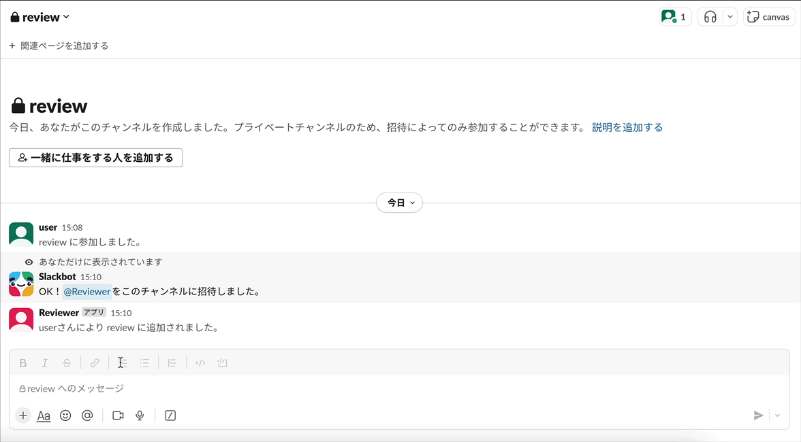
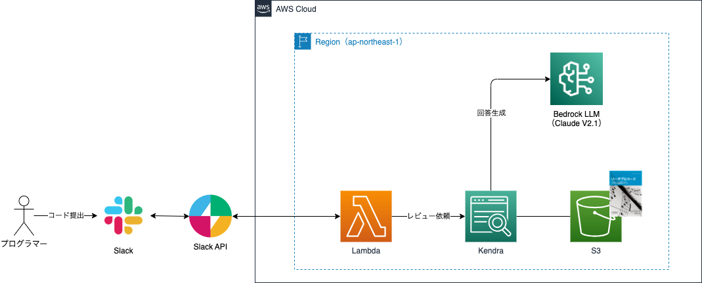

# SAM slack review rag

## 概要

Slack経由でRAGによるコードレビューを依頼するアプリケーションです。

コードレビューはリーダブルコードの「**第Ⅰ部 表面上の改善 第2章 名前に情報を詰め込む**」に焦点を当てて行われます。

### デモ動画

`@Reviewer` とメンションすることで、コードレビューを依頼することができます。

### 構成図

### 環境構築

本環境を構築する手順は、以下の記事で詳しく解説していますので、こちらをご覧ください。

[Slack経由でRAGにコードレビューを依頼してみた 〜 AWS SAM編](https://qiita.com/sakes9/items/6655c1de123c6511b25c)